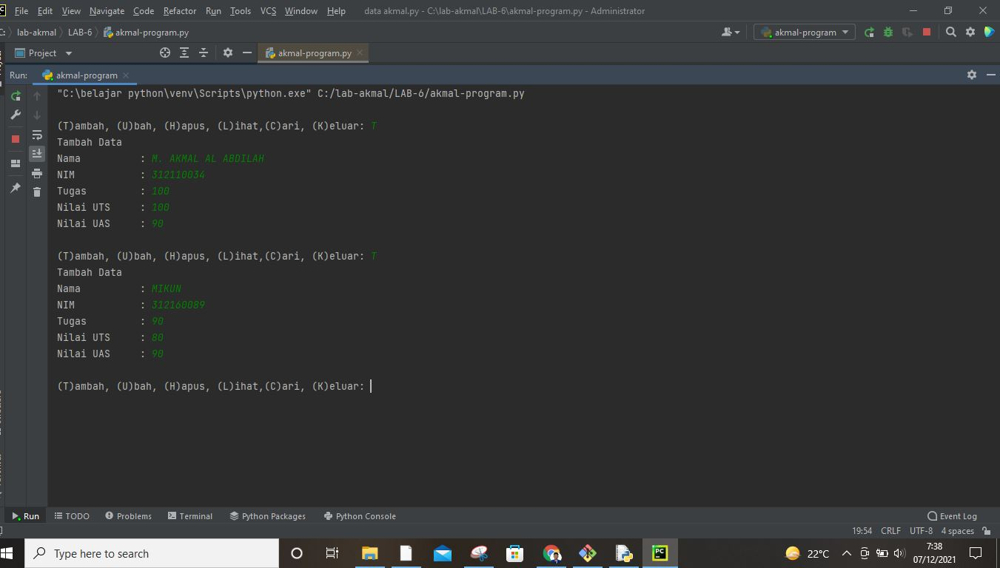
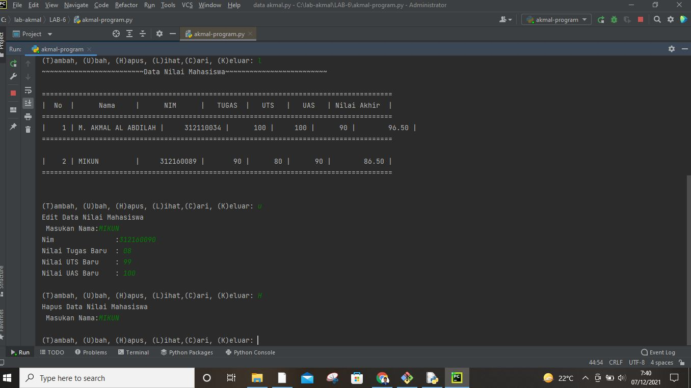
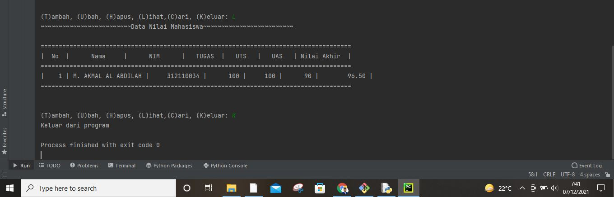
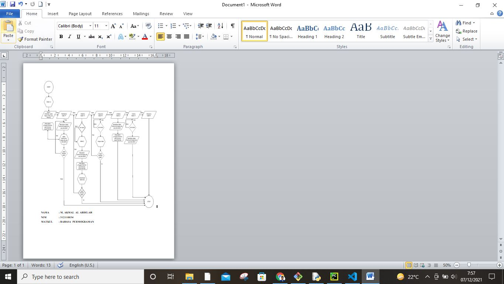
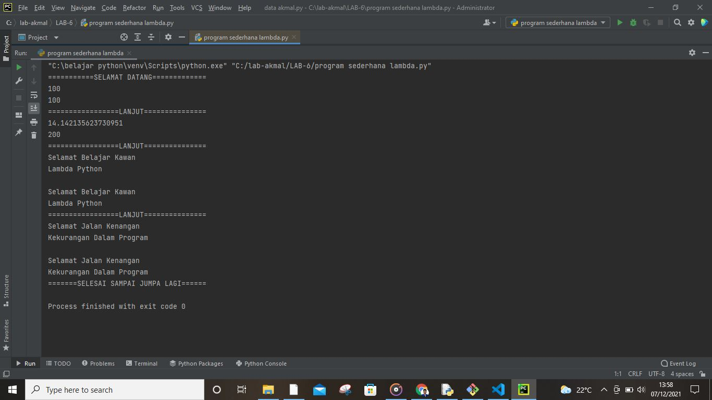

# LAB-6
## Tugas Praktik

# M. AKMAL AL ABDILAH (312110034) TI.21.A.1 BAHASA PEMOGRAMAN

1. Buat program sederhana dengan mengaplikasikan penggunaan fungsi
yang akan menampilkan daftar nilai mahasiswa, dengan ketentuan'
'
• Fungsi tambah() untuk menambah data
• Fungsi tapilkan() untuk menampilkan data
• Fungsi hapus(nama) untuk menghapus data berdasarkan nama
• Fungsi ubah(nama) untuk mengubah data berdasarkan nama
• Buat flowchart dan penjelasan programnya pada README.md. • Commit dan push repository ke github.'
'

2. SCRIP CODING PYTHON:'
'
data = {}
while True:
    print("")
    g = input("(T)ambah, (U)bah, (H)apus, (L)ihat,(C)ari, (K)eluar: ")
    # Untuk keluar dari program
    if g.lower() == "k":
        print("Keluar dari program")
        break
    # untuk melihat list
    elif g.lower() == "l":
        if data.items():
            print("~~~~~~~~~~~~~~~~~~~~~~~~~Data Nilai Mahasiswa~~~~~~~~~~~~~~~~~~~~~~~~~")
            print()
            print("======================================================================================")
            print("|  No  |      Nama     |      NIM      |   TUGAS  |   UTS   |   UAS   | Nilai Akhir  |")
            print("======================================================================================")
            i = 0
            for x in data.items():
                i += 1
                print("| {6:4} | {0:13s} | {1:13} | {2:8d} |  {3:6d} | {4:7d} | {5:12.2f} | " \
                      .format(x[0], x[1][0], x[1][1], x[1][2], x[1][3], x[1][4], i))
                print("======================================================================================")
                print("")
        else:
            print("~~~~~~~~~~~~~~~~~~~~~~~~~Data Nilai Mahasiswa~~~~~~~~~~~~~~~~~~~~~~~~~")
            print()
            print("======================================================================================")
            print("|  No  |      Nama     |      NIM      |   TUGAS  |   UTS   |   UAS   | Nilai Akhir  |")
            print("======================================================================================")
            print("|                                 Tidak Ada Daftar Nilai                             |")
            print("======================================================================================")
    # Untuk menambahkan data
    elif g.lower() == "t":
        print("Tambah Data")
        nama = input("Nama          : ")
        nim = int(input("NIM           : "))
        tugas = int(input("Tugas         : "))
        uts = int(input("Nilai UTS     : "))
        uas = int(input("Nilai UAS     : "))
        nilaiakhir = ((tugas) * 30 / 100 + (uts) * 35 / 100 + (uas) * 35 / 100)
        data[nama] = nim, tugas, uts, uas, nilaiakhir
    # Untuk mengubah data
    elif g.lower() == "u":
        print("Edit Data Nilai Mahasiswa")
        nama = input(" Masukan Nama:")
        if nama in data.keys():
            nim = input("Nim               :")
            tugas = int(input("Nilai Tugas Baru  : "))
            uts = int(input("Nilai UTS Baru    : "))
            uas = int(input("Nilai UAS Baru    : "))
            nilaiakhir = ((tugas) * 30 / 100 + (uts) * 35 / 100 + (uas) * 35 / 100)
            data[nama] = nim, tugas, uts, uas, nilaiakhir
        else:
            print("Data nilai{0} tidak ada ".format(nama))
    # Untuk menghapus data
    elif g.lower() == "h":
        print("Hapus Data Nilai Mahasiswa")
        nama = input(" Masukan Nama:")
        if nama in data.keys():
            del data[nama]
        else:
            print("Data {0} tidak ada".format(nama))
        # Untuk Mencari data
    elif g.lower() == "c":
        print("Cari Data Nilai Mahasiswa")
        nama = input(" Masukan Nama: ")
        if nama in data.keys():
            print("~~~~~~~~~~~~~~~~~~~~~~Data Nilai Mahasiswa~~~~~~~~~~~~~~~~~~~~~~~~")
            print()
            print("==================================================================")
            print("~~~~~~~~~~~NAMA  NIM  TUGAS  UTS UAS NILAI AKHIR~~~~~~~~~~~~~~~~~~~")
            print("| {0} | {1} | ".format(nama, data[nama]))
            print("==================================================================")
        else:
            print("Datanya {0} tidak ada ".format(nama))
    else:
        print("\\~~~~~~~~~~~~~~~~~~~~~~~~~~~Data Nilai Mahasiswa~~~~~~~~~~~~~~~~~~~~~~~~~~~~~~~~~~~//")
        print("======================================================================================")
        print("|  No  |      Nama     |      NIM      |   TUGAS  |   UTS   |   UAS   | Nilai Akhir  |")
        print("======================================================================================")
        print("|                                 Tidak Ada Daftar Nilai                             |")
        print("======================================================================================")

else:
    print("Pilih Menu Yang Tersedia")'
'

3. HASIL GAMBAR OUTPUT DI PYCHRAM'
'

4. GAMBAR FLOWCHART!!'
'

5. Penjelasan!!'
'
Sart
inputkan data={ } sesuai kenginan dengan format dictionary
Gunakan perulangan While True untuk menampilkan data sebanyak banyaknya
Masukan perintah g = input("(T)ambah, (U)bah, (H)apus, (L)ihat,(C)ari, (K)eluar: "),untuk mendapatkan perintah Tambah, Ubah, Hapus,Lihat,Cari,Keluar.
Menambahkan data menggunakan fungsi elif, lalu masukan nama, nim, tugas, uts, uas, nilaiakhir, nilai akhir didapat dari = ((tugas)*30/100+(uts)*35/100+(uas)*35/100)
jika ingin memilih "lihat" gunakan fungsi 'elif' dan gunakan fungsi 'for x in data.items():' untuk memasukan data kedalam tabel data yang kita inputkan, dengan perintah "l". jika data yang tidak terdaftar = 0
Untuk menampilkan pilihan "hapus"gunakan fungsi 'elif' kemudian gunakan fungsi 'if nama in data.keys():' kemudian fungsi'del.data[nama] jika nama yang kita hapus tidak ada dalam tabel maka gunakan fungsi 'else' untuk menampilkan data tidak ada.
lalu untuk menampilan pilihan "cari"" gunakan fungsi 'elif' kemudian gunakan fungsi if nama in data.keys():' untuk mencari data nama kemudian gunakan fungsi 'else' untuk menampilkan data nama yang kita cari tidak ada.
lalu jika ingin keluar dari program gunakan fungsi 'if' kemudian gunakan fungsi break untuk keluar dari data nilai/menghentikan program
Stop'
'

6. Latihan 1'
'
Ubahlah kode dibawah ini menjadi fungsi menggunakan'
'
import math
def a(x):
 return x**2
def b(x, y):
 return math.sqrt(x**2 + y**2)
def c(*args):
 return sum(args)/len(args)
def d(s):
 return "".join(set(s))'
'
 

 # Sekian Depository Kali, ini. Jika ada Banyak kekeliruan dalam program diatas saya mohan maaf karna saya juga masih belajar'
'
